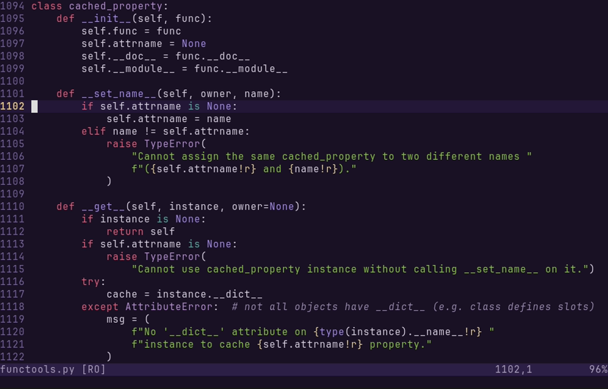
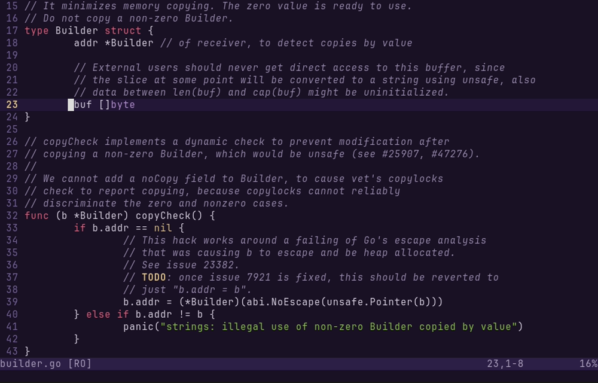
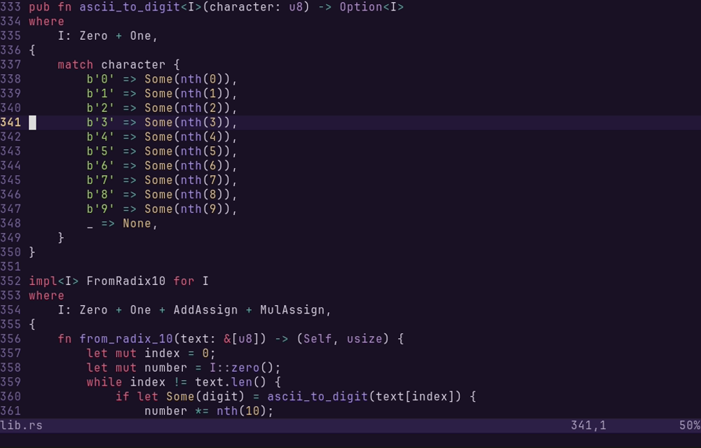
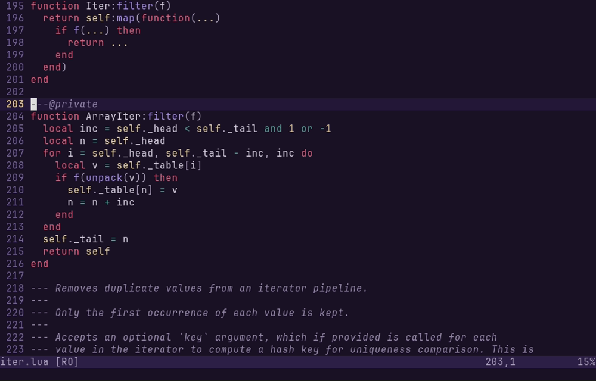

# kukishinobu.vim


A dark Vim/Neovim colorscheme inspired by the official character art of **Kuki Shinobu** from *Genshin Impact*.

Colors are drawn from the character illustration — deep purple backgrounds, her signature green hair, crimson armor plates, and golden accents — and tuned for contrast. Blue and cyan are complementary additions.

<br clear="right">

## Palette

| Base | Hex | Usage | Accent | Hex | Usage |
|------|-----|-------|--------|-----|-------|
|  `bg0` | `#1a1225` | Background |  `green` | `#8bc34a` | Strings |
|  `bg1` | `#241838` | Cursor line |  `ltgreen` | `#a5d46a` | Escapes |
|  `bg2` | `#2e2048` | Status line, menus |  `red` | `#e0607e` | Keywords |
|  `bg3` | `#3a2c55` | Selection, floats |  `ltred` | `#f08ca0` | Labels |
|  `bg4` | `#4a3868` | Indent guides |  `purple` | `#a48ee6` | Functions |
|  `fg0` | `#e8ddf0` | Bright text |  `ltpurp` | `#b490d0` | Types |
|  `fg1` | `#d8d2e2` | Normal text |  `gold` | `#dcc088` | Constants, warnings |
|  `fg2` | `#aca2bd` | Dimmed text |  `ltgold` | `#ead6a4` | Special chars |
|  `fg3` | `#9488aa` | Comments |  `blue` | `#6888b8` | Links, changes |
|  `fg4` | `#75659a` | Line numbers |  `ltblue` | `#88a8d0` | Tags |
|  | |  |  `cyan` | `#5ea8a0` | Operators |
|  | |  |  `ltcyan` | `#80c0b8` | Info, additions |

## Preview

| Python | Go |
|--------|----|
|  |  |

| Rust | Lua |
|------|-----|
|  |  |

Screenshots are generated with [VHS](https://github.com/charmbracelet/vhs) from [`screenshots/preview.tape`](screenshots/preview.tape).

## Installation

### lazy.nvim

```lua
{
  "aisk/kukishinobu.vim",
  lazy = false,
  priority = 1000,
  config = function()
    vim.cmd("colorscheme kukishinobu")
  end,
}
```

### vim-plug

```vim
Plug 'aisk/kukishinobu.vim'
colorscheme kukishinobu
```

### Manual

Clone this repo into your Vim/Neovim packages directory:

```bash
# Neovim
git clone https://github.com/aisk/kukishinobu.vim \
  ~/.local/share/nvim/site/pack/plugins/start/kukishinobu.vim

# Vim
git clone https://github.com/aisk/kukishinobu.vim \
  ~/.vim/pack/plugins/start/kukishinobu.vim
```

Then add to your config:

```vim
colorscheme kukishinobu
```

## Supported Plugins

- [Treesitter](https://github.com/nvim-treesitter/nvim-treesitter)
- [LSP Semantic Tokens](https://neovim.io/doc/user/lsp.html)
- [Telescope](https://github.com/nvim-telescope/telescope.nvim)
- [Gitsigns](https://github.com/lewis6991/gitsigns.nvim)
- [indent-blankline](https://github.com/lukas-reineke/indent-blankline.nvim)
- [which-key](https://github.com/folke/which-key.nvim)
- [lazy.nvim](https://github.com/folke/lazy.nvim)

## License

MIT
